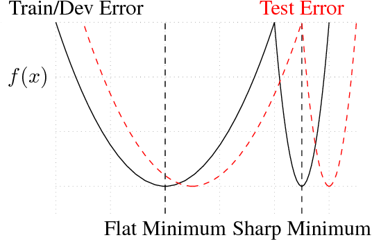

# A Machine Learning Crash Course that Happens to Crash into Neural Networks

***By Faraz Yashar - Last Updated February 25, 2019***

## 0 Before We Begin

- This guide aims to be a quick, conversational, yet mathematical guide to machine learning and neural networks.
- *This is a draft. Please send me corrections and comments! Let me know if you get lost or confused anywhere!*
- Prerequisites are basic linear algebra (vector and matrix multiplication) and multivariate calculus (gradients).
- This guide involves cats because the internet. In addition, it involves birds because cats. Unfortunately, the cats disappear half-way through since I didn't have time to develop all the examples.
- Since this is foremost a machine learning guide, I will primarily use the symbols and jargon used by the machine learning community. Statisticians have their jargon for these concepts, and I've provided them in another table.
- I've provided example code for you to play with. Do it! Use a Python 3 notebook in [Google Colab](colab.research.google.com) or use one with [Anaconda](https://docs.anaconda.com/anaconda/install/) locally. You'll probably regret choosing Anaconda.
- ***Important disclaimer***: this guide ends with neural networks solely because of the paper I'm presenting. Regardless of what the news might tell you, they are not by any means a holy grail: rather they are just another tool meant to be used judiciously! There are many applications where it's a *terrible idea* to use a neural net.

## 1 Training Wheels

This aims to be an introduction to machine learning. If you're already familiar with machine learning and want to learn about neural networks, skip ahead to part two.

### 1.1 Learning Fluffy Functions

Your sweet cat Fluffy has the habit of gifting you dead birds. After you clean your hundredth decapitated Tweetie bird from your kitchen floor, you decide it's time to stop Fluffy's offerings[^1]. You already have a camera and power controlled cat flap at the ready, now you just need to detect when Fluffy's entering with prey to block her appropriately. This is an example of a *classification* problem. More specifically, you need to write some function $f$ that determines whether a frame of video contains Fluffy with a dead bird.
$$
f(image) \in \{ \text{true}, \text{false}\}
$$
At this point, you have two general strategies. You could attempt to hand-craft some function to detect dead birds, but how exactly? After scanning through several hundred photos, you become overwhelmed with the possibilities and you wonder if there's not some algorithm that can learn to functions which classify images.

Machine learning broadly aims to do just that: learn functions from data. The hope is that these functions can be used to predict outputs from unseen data. Aside from classification, there are many different types of machine learning problems that have been enumerated in the table below.

| Type of ML Problem        | Description                               | Example                                                      |
| :------------------------ | :---------------------------------------- | :----------------------------------------------------------- |
| Classification            | Pick one of N labels                      | Predict when fluffy has a dead birt (supervised)             |
| Regression                | Predict numerical values                  | Predict the size of the bird given food eaten (supervised)   |
| Clustering                | Group similar examples                    | Group documents into topics (unsupervised)                   |
| Association rule learning | Infer likely association patterns in data | If you buy a cat, you're likely to buy cat food (unsupervised) |
| Structured output         | Create complex output beyond a scalar     | Image recognition bounding boxes, parse trees (supervised)   |
| Ranking                   | Identify position on a scale or status    | Search ranking (supervised)                                  |
| Generative Problems       | Learn to make X                           | Text generation, art generation (supervised/unsupervised)    |
| Reinforcement Learning    | Optimize actions based on rewards         | Playing chess, scheduling an elevator (separate paradigm)    |

All of these problems fall under three major paradigms:

- *Supervised learning* - train a model using labeled data
- *Unsupervised learning* - learn something from the structure inherent in the data without labels
- *Reinforcement learning* - learn to make decisions using feedback from the environment

Of the three, reinforcement learning is by far the most different. In the literature, you'll also see *semisupervised learning,*  which refers to using some blend of supervised and unsupervised learning.

In this guide, we'll focus on *supervised learning*: particularly *classification* which aims to map an input to a categorical output and *regression* which aims to map an input to a numerical value.

Quick! Back to Fluffy! (I think I heard another bird die...) With just the images, we can't do much since classification, a supervised learning problem, requires labeled data. You need to label all your images true or false corresponding to whether she's approaching with a dead bird. In symbols, we now have a data set $D = \{ (\mathbf{M}_i, y) \}_{i=1..n} \subset \mathbb{R}^{r \times g \times b}  \times \{1, 0\}$ where $\mathbf{M}_i$ is a tensor (in this case a 3D matrix) that corresponds to the RGB image pixels and $y$ corresponds to dead bird status. To simplify the problem, we might transform the input into vectors $\mathbf{x}_i$ that represent the number of red pixels in a given row of the image.

Armed with your pixel counts and labels, you now need to search a hypothesis space of functions $\mathcal{H} : X \mapsto Y$ for some specific function $h \in \mathcal{H}$ that best predicts whether Fluffy has kill. $\mathcal{H}$ could be the set of all polynomial-based logistic regression classifiers or something fancier. Now you just need some procedure, which given your data and a hypothesis space, returns the best predictor $h(\mathbf{x})$.

What does it mean to be the best predictor anyway? For all of our observations, we could check to see if $h(\mathbf{x}_i)$ guessed the true label $y_i$ correctly and assign some score accordingly. Statisticians and machine learning people are quite a pessimistic bunch, so they like to evaluate a *loss function* comparing the true output $y_i$ to the predicted output $h_T(\mathbf{x}_i)$ to measure bad the classifier or regressor performs. For example, you might use the *zero-one loss*, which returns one if the classifier predicts correctly and zero otherwise. Loss functions map to positive real numbers. The overall goal would be to find an $h*$ which minimizes the average loss computed over all the examples.
$$
h^{*}(\mathbf{x}) = \arg\min_{h} L_D(h) = \frac{1}{N}\sum_{i=1}^{N}\ell(y_i, h(\mathbf{x}_i))
$$

Okay! That was a lot, and frankly very abstract. Fear not though, we're going to dissect the above in the coming sections. Here are the big takeaways.

- Machine learning aims to learn a predictive function from data.
- These functions are found by searching through a hypothesis space $\mathcal{H}$ for a function $h_T$ using a training set.
- The goal is to find an $h$ that predicts unseen data points well, that is it minimizes the average over some scalar-valued loss function $\ell(y_i, h_T(\mathbf{x}_i))$

### 1.2 Linear Regression

While cleaning the kitchen, you also find a notebook wherein Fluffy keeps a meticulous record of how much food she's eaten and the weight of every bird she's killed: $D_2 = \{ (x_i, y_i) \}_{i=1..n} \subset \R \times \R$ . Congrats on raising a bonafide serial killer. Distracted by this new found data, you wonder if there's any way to predict the size of her victim given Fluffy's kibble consumption.

First, let's move the notion of a *hypothesis space* further from the hypothetical. We might hypothesize that some weighting of food eaten and other factors (water lapped, weather) might predict our outcome well. This is an example of *linear regression*. In linear regression, our hypothesis space is all functions of the following form
$$
\hat{y} = h(\mathbf{x}) = \mathbf{w}^T\mathbf{x} + b
$$
where $\mathbf{w}$ are the weights of the factors under consideration and $b$ is a bias term (a.k.a. intercept.) We call this model linear because we take a linear combination of the inputs and add a bias to create our predictor.[^2] Now we need to hunt through the hypothesis space (i.e. all possible parameters for the model) and find one that minimizes the loss, but what loss? Maybe the mean absolute error $|y - \hat{y}|$ across all samples? Good guess, but not quite! For reasons that'll be clear in the next section, we'd like a differentiable loss function. A commonly used loss function is the quadratic loss (a.k.a. squared-error loss)  $(y - \hat{y})^2$. How do we go about minimizing this mean squared-error?

### 1.3 Gradient Descent: Getting to the Bottom of Things

If you were to go to a mathematician with this problem, he'd excitedly point out that if you combine the weights and bias into a single vector $\mathbf{v}$, and rewrite  $\mathbf{x}$ and $y$ values into the following matrices:
$$
X = \begin{bmatrix}
x_{1,1} & ... & x_{1,p} & 1\\
\vdots & \vdots & \ddots & \vdots \\
 x_{n,1} & ... & x_{n,p} & 1
\end{bmatrix}

\mathbf{y} = \begin{bmatrix}
y_1 \\
\vdots \\
y_n
\end{bmatrix}
$$
A closed-form least-squares solution can be found by solving $X^TX\mathbf{v} = X^T\mathbf{y}$! Well, under certain assumptions about $X$, he says. He then continues to talk about rank, underdetermined systems, and you, now half-awake, hear him ramble on about the pseudoinverse, SVD, DVD, VHS... wait what?! Wake up! This is math! It's important! You, in your gloriously lazy incompetence, say, "OK boomer, all this math is great, but do you have anything that like just works without me having to, um, you know, think? I just threw out all my DVDs, I don't need another one. Also, it'd be dope to minimize like anything, not just this. Also, it'd be nice if I only needed to know derivatives."

The mathematician rolls his eyes, calls you ten names under his breath, and begrudgingly teaches you the *gradient descent algorithm* for finding the minimum of a convex function.

Say we're at some point on a function $f$. A reasonable direction to look for the minimum would be to travel in the direction it's decreasing the fastest. That direction is $-\nabla f$, the negative of the gradient. Now instead of just traveling straight down the gradient, let's take a small step in that direction. From there, let's recompute the gradient and take a small step further in that new direction. If we repeat this process we should eventually be close to a local minimum. Better yet, if we're traveling through a convex space, we'll be close to a global minimum... or so we hope. Here's a rough sketch of the algorithm in Python:

```python
# Gradient descent using the entire data set on every iteration
for i in range(iterations):
  grad_weights = compute_gradient(loss_fn, data, weights)
  weights = weights - step_size * grad_weights
  # The step size is also known as the learning rate in machine learning
```

Even though we know gradient descent will find minima for convex regions, there are a host of other issues.

1. You have no idea how long it will take.
2. If you're really unlucky, you might get stuck bouncing around.
3. If you're not in a convex space you're screwed.

Because of this, there are a whole host of other remedies and optimization methods, but since you're lazy—and seeking a one-trick pony—gradient descent and its variants, which we'll see later, should suffice. Also note the reason for using a differentiable loss function is clear: without it we wouldn't be able to compute a gradient.

One final note: it's also useful to normalize the data or at least mean center it before training. This helps to guide the gradient towards the minimum more directly. Additionally, certain optimization algorithms assume the data is normalized.

### 1.4 Regressing Back to Regression

Armed with that knowledge, we can take our linear model

$$
\hat{y} = h(\mathbf{x}) = \mathbf{w}^T\mathbf{x} + b = w_1 x_1 + w_2 x_2 + ... + w_n x_n + b
$$

and put it in our loss function.

$$
L(\mathbf{w}, b) = L(\mathbf{v}) = \frac{1}{N}\sum_{i=1}^N \ell_{\mathbf{v}}(y_i,h(\mathbf{x}_i)) =
\frac{1}{n} \sum_{i=1}^{N}\left(y_i - (w_1x_1 + ... + w_n x_n + b)\right)^2
$$

This is a convex function, which means we can minimize it using gradient descent! Don't believe me? Just check that the Hessian is positive semidefinite, a requirement for convexity. Now we can compute the expression for the gradient[^3]:

$$
\nabla L = \begin{bmatrix}

{ \partial L \over \partial w_1 }\\
{ \partial L \over \partial w_2 }\\
\vdots \\
{ \partial L \over \partial w_n }\\
{ \partial L \over \partial b }\\
\end{bmatrix} =
\frac{1}{n} \sum_{i=1}^{N}
\begin{bmatrix}
2\left(y_i - (w_1x_1 + ... + w_n x_n + b)\right)(-x_1) \\
2\left(y_i - (w_1x_1 + ... + w_n x_n + b)\right)(-x_2) \\
\vdots \\
2\left(y_i - (w_1x_1 + ... + w_n x_n + b)\right)(-x_n)\\
2\left(y_i - (w_1x_1 + ... + w_n x_n + b)\right)(-1)\\
\end{bmatrix} =
-\frac{2}{n} \sum_{i=1}^{N}
\begin{bmatrix}
x_1\left(y_i - \hat{y_i}\right) \\
x_2\left(y_i - \hat{y_i}\right) \\
\vdots \\
x_n\left(y_i - \hat{y_i}\right) \\
1\left(y_i - \hat{y_i}\right) \\
\end{bmatrix}
$$

Then we follow the gradient descent algorithm to find the line of best fit.

```python
def linreg(x, y, alpha=1e-4, max_iters=500):
    """
    x - the example inputs
    y - the output for the given inputs
    alpha - the learning rate
    max_iters - the maximum number of iterations
    """

    n, w, b, iters = len(x), 0, 0, 0

    # Mean center the data
    xbar, ybar = np.mean(x), np.mean(y)
    xc, yc = x - xbar, y - ybar

    while iters < max_iters:
        # Update the weights and biases
        errors = yc - w*xc - b
        w = w - alpha * (-2/n) * sum(xc*errors)
        b = b - alpha * (-2/n) * sum(errors)

    print(f"Parameters found after {iters} iterations:")
    print(f"w={w} b={b - w*xbar + ybar}")
```

Below is a plot of the algorithm above converging on the line of best fit for the data set.


`Parameters found after 268 iterations with learning rate of 0.0001 a tolerance of 0.0001:
w=-0.7894878652069325 b=68.92751390453444`

### 1.6 Classifying Kitties

Now back to our first task: catching Fluffy with kill. Say we're using the number of red pixels to classify the image, what family of functions should we consider for our hypothesis space? How do we think about our loss function?


Ideally, we need some sort of step function. If we model $\log {\frac{y}{1 - y}}$, instead of $y$ alone and make certain assumptions about the distribution of the data, it turns out we're really modeling the log odds where $y$ corresponds to the probability Fluffy has bird!  Solving for $y$, we end up with the following model:
$$
\hat{y} = h(\mathbf{x}) = \sigma(\mathbf{w}^T\mathbf{x} + b) \text{ where } \sigma(f) = {1 \over 1 + e^{-f}}  \text{ and }  \hat y \in [0, 1]
$$
The $\sigma$ we found is called *logistic function*. It's an example of a *score function* which is capable of creating a *linear decision boundary* that separates the data into two classes. Many score functions exist which satisfy this property and allow us to restrict the output of a function between 0 and 1.


Now for a very important aside... ***Just because some value is restricted between zero and one does not mean that it's a probability.***  I cannot emphasize that enough, and I'll be sure to rant about it again later.

Now we consider the loss function. Our $y$ values are 0 and 1 corresponding to whether Fluffy has a bird. Currently, $\hat y$ is a predicted probability, but we can easily turn that into 0 or 1 by using some cut off (e.g. 0.5 and below is 0 else 1). For the loss then, we could use the zero-one loss where the loss is zero if we guess correctly or 1 if don't, but we know that'll lead to differentiability issues. We could try using the squared-error loss, but that results in a non-convex function that we cannot easily optimize. Instead, we use a special differentiable loss function is used known as the *cross-entropy loss*.

$$
\ell(y, p) = \begin{cases}
-\log(p) & \text{ if y = 1} \\
-\log(1-p) &\text{ otherwise}
\end{cases} =
-y\log(p)- (1 - y)\log(1 - p)
$$

Take a minute to think through what happens based on different predicted probabilities. How does the loss function manage to be both piecewise in a sense while remaining differentiable?

Sorry to disturb your pondering, but it looks like the mathematician is back... He asks glibly how's gradient descent treating you. You cautiously respond fine. Well, since you love derivatives so much, he says, why don't you find the gradient of this?

$$
L(\mathbf{w}, b) =
\frac{1}{N}\sum_{i=0}^N
\left[
-y_i\log\left({1 \over 1 + e^{-\mathbf{w}^T\mathbf{x}_i-b}}\right)- (1 - y_i)\log\left(1 - {1 \over 1 + e^{-\mathbf{w}^T\mathbf{x}_i-b}}\right)
\right]
$$

After cursing for a bit, you rewrite the function as $\ell(\sigma(f(w)))$ and start taking derivatives using the chain rule:

$$
l(\sigma) = -y\log(\sigma)- (1 - y)\log(1 - \sigma) \\
\sigma(f) = \frac{1}{1+e^{-f}} \\
f(w) = wx +b \\
$$

$$
{ \partial \ell \over \partial w_i } = { \partial \ell \over \partial \sigma } { \partial \sigma \over \partial f }{\partial f \over \partial w_i} = \left[-{y_i \over \sigma(f) }- { 1 - y_i \over 1 - \sigma(f) }(-1)\right]
\left[
\sigma(f)(1-\sigma(f))
\right]
\left[
x_i
\right]
$$


The mathematician is impressed and decides to let you in on a little secret called  *automatic differentiation*: there are packages that do the dirty work of computing derivatives for you!

```python
>>> import autograd.numpy as np  # Thinly-wrapped numpy
>>> from autograd import grad    # The only autograd function you may ever need
>>>
>>> def logistic(x):                 # Define a function
...     return 1.0 / (1.0 + np.exp(-x))
>>> grad_logistic = grad(logistic)   # Obtain its gradient function
>>> grad_logistic(1.0)               # Evaluate the gradient at x = 1.0
0.19661193324148188
```

Logistic regression is now a breeze with gradient descent:

```python
def logreg(x, y, alpha=1e-4, max_iters=500):
    # We combine w and b to make the gradient simpler
    x = np.stack((x, np.ones(len(x))), axis=1)

    def loss(w):
        p = 1 / (1 + np.exp(-np.dot(x, w)))
        return -np.sum(np.log(p*y + (1-p)*(1-y)))

    gradient = grad(loss)

    w = np.array([0, 0])
    while iters < max_iters:
        w -= alpha*gradient(weights)

    print(f"Parameters found after {iters} iterations: w={w[0]} b={w[1]}")
```


`Parameters found after 5000 iterations: w=0.24023270169280683 b=-6.16157486947982`

### 1.7 Overfitting and the Train/Test Split

In the two examples above we used all our data for training. In practice, it's a *very bad idea* to use all of your data for training. Using all of the data in $D$, we will likely *overfit* the model to the data, and it will not be able to *generalize* well to new, unseen data. In other words, if I give you a new point, your algorithm will likely predict poorly because your model has in a sense memorized the data.


In practice, only  75-80% of the data is used as a *training set* and the remaining examples are kept as a *test set*. The training set is used to train the model while the test set is used to evaluate the final model selected during training. Overfitting can also occur depending on the *expressiveness* of the function you're trying to learn. A degree-20 polynomial, for example, is far more prone to overfitting than a degree-3 polynomial. In general, models with more parameters exhibit greater overfitting. This trade-off between a model that varies highly with the data (high variance) and a model more true to its assumptions (high bias) is known as the *bias-variance tradeoff*. There is a statistical definition of the bias-variance tradeoff, but I'll spare you the details. Image credit[^8]

###  1.8 Multiclass Logistic Regression

You recently discover your camera comes with a proximity sensor that gives you Fluffy's horizontal and vertical distance from the door. Looking at the data, you see the following pattern:


This now gives us three classes to consider. How do we generalize from binary classification to multi-class classification (a.k.a. multinomial classification). First, let's consider the score function. Instead of obtaining a single probability, we'd like to obtain a vector of probabilities, so we'll upgrade or logistic function to its generalized form the *softmax function*:

$$
\mathbf{s}(\mathbf{z})_i = \frac{e^{\mathbf{z}_i}}{\sum_{k=1}^K e^{\mathbf{z}_k}} \text{ for } i = 1, \dotsc , K \text{ and } \mathbf z\in\R^K
$$

In the case of logistic regression, our $\mathbf{z}= \mathbf{w}^T \mathbf{x} + b$ :

$$
\mathbf{s}_i(\mathbf{x} ) = { \exp{\left(\mathbf{w}_{k'}^T\mathbf{x}+b_{k'} \right)} \over {\sum_{k=1}^K \exp{\left(\mathbf{w}_k^T\mathbf{x}+b_k \right)}}}
\\
\mathbf{s}(\mathbf{x}) =
\begin{bmatrix}
s_1 \\
\vdots \\
s_K
\end{bmatrix} \text { where } s_i \in [0, 1] \text{ and } s_1 + ... + s_k = 1
$$

So given any point $x \in R^d$, a multi-class logistic-regression classifier will compute a vector $\mathbf{s}(\mathbf{x})$ of $K$ scores, one score per class. By design, the scores of a softmax add to one. In the case of multi-class logistic regression, these scores correspond to the probability that $\mathbf{x}$ is in each class.

Now for the loss. Before considering how to generalize the cross-entropy loss, we should first consider how we want to represent a multiclass label. Earlier, we used a single scalar in $\{0, 1\}$ to represent an outcome, but now that we have three classes, should we use $\{0, 1, 2\}$? Take a moment to ponder what issues might arise. The biggest issue is that using 2 incorporates a complicating notion of magnitude. Instead, we use the *one-hot encoding* where we "turn on" the entry of zero vector which corresponds to the output class. For example, say we have three classes ($K=3$) and our output is label two ($y = 2$), the one-hot encoding would be $\mathbf{y} = [0, 1, 0]^T$.

With the one-hot encoding of our label and our score vector, we can then use the generalized cross-entropy loss:

$$
\ell(\mathbf{y}, \mathbf{s}) = -\sum_{k=1}^Ky_k \log s_k \\
$$

Finally, we can take the average loss across the data set as the objective function which we'll minimize.

$$
L(b, \mathbf{w}) = \frac{1}{N}\sum_{n=1}^N\ell(\mathbf{y}_n; \mathbf{w}, b)
$$

Computing the Hessian you'll find that the resulting function is convex in the parameters $b$ and $\mathbf{w}$, so you can use gradient descent to minimize them. To compute this gradient, we'd turn to automatic differentiation, or better yet, we can turn to a software library.

### 1.8 ML Libraries

While it's fun to write your own regression solvers by hand, it's often wiser to use third-party packages to do the heavy lifting provided that you actually have some idea what the package is doing. Classically, the R ecosystem has dominated this space, but in the past decade or so, Python has had a lot of growth. This guide and its author are clearly biased towards Python.

Scikit-learn is the most comprehensive and popular library you can find. With it, our classification problem turns into *four* lines. Here's an example of classifying a two-dimensional data set into three classes.

```python
from sklearn.linear_model import LogisticRegression

model = LogisticRegression(C=1e5) # Use C=1e5 to disable regularization
model.fit(xs, ys)
model.predict([[0, 0]]) # => [1]
model.predict_proba([[0, 0]]) # => array([[0.21108565, 0.43698304, 0.35193131]])
```

Notice how multi-class logistic regression is still creating separating hyperplanes in the data.


### 1.9 Performance in Regression

So far we've been fitting models to the data and making pretty plots, but we need a good way to measure and compare how well different models perform against the data. For regression, we often use the mean-squared error as our metric. Instead of further investigations of Fluffy, let's move on to a data set that comes with scikit-learn. One data set intended for regression is the [Boston housing data set](https://scikit-learn.org/stable/datasets/index.html#boston-dataset). Here the aim is to predict the price of a house based on its characteristics. I mentioned briefly that it's a *very bad idea* to use all of your data for training: such a bad idea that you should never do it. A better idea is to select  some portion of your data randomly (typically 20-25%) to use for testing and use the remaining data to train your model.  Let's do that now and train a linear regression model.

```python
import sklearn
from sklearn.model_selection import train_test_split

X, y = sklearn.datasets.load_boston(return_X_y=True)
X_train, X_test, y_train, y_test = train_test_split(X, y, test_size=0.25, random_state=0)

model = LinearRegression()
model.fit(X_train, y_train)

y_pred = model.predict(X_test)
mean_squared_error(y_test, y_pred) # => 29.78224509230237
```

Can we do any better?

Now let's try to fit a model that makes use of *regularization*. Broadly, the idea here is to add another parameter to the loss function which will help the model generalize better to new data. In linear regression, for example, it might make sense to either eliminate weights or drive them close to zero if you suspect that some predictors in the data set may not correlate with the outcome. For example, you might use the $\ell_2$-norm of the weights as a penalty in your loss function:

$$
h_{\mathbf{w}}^{*}(\mathbf{x}) = \arg\min_{h_{\mathbf{w}}} L_D(h_{\mathbf{w}}) + \lambda||\mathbf{w}||^2_2=
\arg\min_{h_{\mathbf{w}}}
\left\{
\frac{1}{N}\sum_{i=1}^{N}\ell(y_i, h(\mathbf{x}_i)) + \lambda\mathbf{w}^T\mathbf{w}
\right\}
$$

This is also known as ridge regression. Notice, the $\lambda$ parameter has nothing do with our model parameters $\mathbf{w}$ and only controls how much we weight the norm of the weights in our penalty. For this reason, $\lambda$ is known as a hyperparameter. But how much should we penalize the weights in relation to the loss? How much should we regularize? What value for $\lambda$ do we pick? How would we set hyperparameters more generally? The answer is *cross-validation*. The procedure for K-fold cross-validation is described as follows. For each hyperparameter $\lambda$ of interest, perform the following:

1. Shuffle the data set randomly.
2. Split the dataset into $k$ groups (also known as folds)
3. For each group:
   1. Make that group the test set
   2. Use the remaining groups as the training set
   3. Fit a model on the training set, evaluate it on the test set, and store the evaluation metric
4. Summarize the model's performance across all $k$ groups.

After you've performed this for all combinations of hyperparameters of interest (i.e. grid search), select the one that performs the best on the training data set. Then retrain the model using all of the training data using the hyperparameters you found, and evaluate the model against the held-out test set.

```python
from sklearn.linear_model import Ridge
from sklearn.model_selection import KFold

lambdas = [0.001, 0.1, 1, 10, 100]
kf = KFold(n_splits=5)

mses = []
for lambda_ in lambdas:
    mses_for_lambda = []
    for train_index, test_index in kf.split(X_train):
        X_tr, X_te = X_train[train_index], X_train[test_index]
        y_tr, y_te = y_train[train_index], y_train[test_index]

        model = Ridge(alpha = lambda_)
        model.fit(X_tr, y_tr)
        y_pred = model.predict(X_test)

        mses_for_lambda.append(mean_squared_error(y_test, y_pred))
    mses.append(np.mean(mses_for_lambda))

mse, i = min([(mse, i) for i, mse in enumerate(mses)])
print(f"Best lambda found {lambdas[i]} with MSE {mse}")
# => Best lambda found 0.001 with MSE 30.257115164419343
```

In this case, we didn't happen to see an improvement in generalization performance with $\ell_2$ regularization.

### 1.10 Performance in Classification

For classification, we need a different measure than the mean-squared error. The *confusion matrix* is a common way to evaluate the performance of a classification model.


The cells above represent how many times the model predicted a label for a given true label. The labels on the diagonals represent correct classifications. The off-diagonal terms are mistakes. For example, the cell with a value of 1 is a case where the classifier predicted that Fluffy was not present when in fact she was.

Binary classifiers are very common and as such there a number of well-known statistics can be computed from the matrix[^9]:


It's often convenient to use a single statistic to compare classifiers. *Accuracy* is one measure commonly used and intuitive measure: how many precautions did we make correctly of all the predictions made? Accuracy alone though is a poor metric. Classifiers make tradeoffs between different characteristics depending on the threshold probabilities where the classes are determined. For example, it might be very dangerous or expensive to misclassify an individual as a positive case, so you might pick a high threshold at 0.8, trading false positives for false negatives. As such, we might be interested in the performance of the classifier across a range of thresholds. For this, we use the *area under the receiver operating characteristic curve (AUCROC or AUC)* as a metric. The closer the AUCROC is to 1 the better the classifier. Here's an example of logistic regression in scikit-learn using its built-in cross-validation.

```python
import sklearn
from sklearn.model_selection import train_test_split
from sklearn.linear_model import LogisticRegressionCV
from sklearn.metrics import roc_auc_score, roc_curve

X, y = sklearn.datasets.load_breast_cancer(return_X_y=True)
X_train, X_test, y_train, y_test = train_test_split(X, y, test_size=0.25, random_state=0)

model = LogisticRegressionCV(Cs = [0.1, 1, 10, 100], cv = 5, max_iter=3000, tol=0.01)
model.fit(X_train, y_train)
y_pred = model.predict(X_test)

# Predict probabilities
probs = model.predict_proba(X_test)[:, 1]

# Calculate scores and curves
auc = roc_auc_score(y_test, probs)
fpr, tpr, _ = roc_curve(y_test, probs)

# Plot the roc curve for the model
plt.plot([0, 1], [0, 1], linestyle='--', label="No Skill")
plt.plot(lr_fpr, lr_tpr, marker='.', label='Logistic')
plt.xlabel('False Positive Rate')
plt.ylabel('True Positive Rate')
plt.legend()
plt.show()

print('No Skill: ROC AUC=0.500')
print('Logistic: ROC AUC=%.3f' % (auc))

# => No Skill: ROC AUC=0.500
# => Logistic: ROC AUC=0.997
```


The no-skill line reflects the performance of a classifier that guesses each class by flipping a balanced coin (AUC=0.5). Depending on your use case, you would pick a threshold for your probability based on the characteristics of the potential outcomes. Unfortunately, both accuracy and AUCROC are poor metrics in many settings due to imbalanced data. Consider the case where you're tasked to classify 10 needles in a haystack of straw, an example of imbalanced data classes, you'd achieve high accuracy if you just guessed that everything was straw. To resolve this, we might use other measures such as *precision* and *recall*.

### 1.11 Things that Don't Look Linear

So far, all the problems we've dealt with involved linear functions. What happens if our decision boundary can't be described easily by a hyperplane?


There are a few tools we can reach for in this case. The first would be to perform *feature engineering* on the data set. In this case, we could imagine projecting the data onto a paraboloid in $\R^3$ turning our data set that's not linearly separable into one that is linearly separable.


This is effectively fitting a logistic regression against a data matrix $[\mathbf{x_1}^2 ~~ \mathbf{x_2}^2 ~~ \mathbf{x_1} \mathbf{x_2} ~~ \mathbf{x_1} ~~ \mathbf{x_2} ~~ \mathbf{1}]$ through a process known as *kernalization*.

$$
\mathbf{w}^T\mathbf{x}+b \rightarrow \mathbf{w}^T\phi(\mathbf{x}) + b
$$

What if you have a more gnarly data set? There is a suite of other kernel-based methods such as Gaussian process and support vector machines. One of the nice features of Gaussian processes and support vector machines in that they are universal function approximators:  these methods are capable of approximating any measurable or continuous function up to the desired accuracy.

Say you don't want to bother with mucking with a kernel  to handle your nonlinearity. There are other kernel free methods that have this process too such as K-nearest neighbors, random forests, and neural networks.

### 1.12 Miscellanea

#### Translating between Statistics and Machine Learning

| Statistics                                  | Machine Learning               | What is it?                                                  |
| ------------------------------------------- | ------------------------------ | ------------------------------------------------------------ |
| record, data row, data point, observation   | example, instance, observation | a complete data entry                                        |
| covariate, predictior, independent variable | feature, input                 | the input variable names                                     |
| dependent variable, response variable       | label, output                  | the output variable name                                     |
| estimation                                  | learning                       | figuring out the parameters of your model                    |
| bias                                        | underfitting                   | when your model leans more towards its own assumptions than the data |
| $\mathbf{\beta}$, coefficients              | $\mathbf{w}$, weights          | the parameters to be estimated                               |
| $\beta_0$, intercept                        | $b$, bias                      | the $b$ in $\mathbf{w}^T\mathbf{x}+b$... blame the ML people for picking an awful name |
| multinomial                                 | multiclass                     | something has many labels                                    |

## 2 Neural Networks and Deep Learning

### 2.1 Motivations

In 1958, psychologist Frank Rosenblatt publish a paper on a linear classifier based on a model of a neuron as a circuit. This perceptron algorithm is sketched by the following diagram[^4]:


Essentially, we take the dot product of the inputs with the weights and pass them through a unit-step activation function. Remind you of anything? Perhaps logistic regression? It turns out, logistic regression is the perceptron algorithm with the addition of the logistic function before the step activation. Just as before, the perceptron is parameterized by weights $\mathbf{w}$ and bias $b$.

In order to make the algorithm more expressive, others later developed the idea of multilayered perceptrons with the hope that they could learn more expressive functions. Perhaps they could learn both the parameters $\mathbf{w}, b$ of the model and the feature transformation $\phi$.

$$
h(x) = \mathbf{w}^T\phi(\mathbf{x}) \\
\phi(x) = \sigma\left(U\mathbf{x}+\mathbf{c} \right)
$$

Here there are three parameters to learn $\mathbf{w}$, $b$, and $A$. Here $\sigma$ is the *activation function* which can be any function that maps the output to a real value in the range [0, 1]. Historically, the activation function used to be the logistic. For computational convenience, however, the *rectified linear unit (ReLU)* is used since the gradients of the logistic at infinity go to zero, which helps to correct what's known as the vanishing gradient problem. The ReLU is simply $\sigma(x) = \max(0, x)$. At times, other sigmoidal (e.g. logistic, tanh) functions may be used in parts of the network, particularly at the output node. Other activation functions are used, and the best choice is still a moving target. See https://ml-cheatsheet.readthedocs.io/en/latest/activation_functions.html.


Let's expand the neural network we've defined above to see what's going on inside:

$$
\begin{align}
h(\mathbf{x}) &= \mathbf{w}^T\max(U\mathbf{x} + \mathbf{c}, 0) \\
&= \sum_i w_i \max(\mathbf{u}_i^T\mathbf{x} + c_i)
\end{align}
$$

where $\mathbf{u}_i$ is a row of $U$. Here, every perceptron or neuron feeds forward values that are transformed by weights $U$ and biases $\mathbf{c}$ of the following nodes. This is effectively the same thing as splicing together piecewise linear components where you get to decide how many components you wish to have. From here we get the universal function approximation theorem from neural networks. A feed-forward network with a single hidden layer of some finite depth can approximate continuos functions on $\R^n$. That network might need to grow exponentially wide to approximate your function, but it'll work!

### 2.2 Deep Learning - Hidden Layers

So we have one way to increase the expressivity of a network: increasing the number of notes in a layer. A second method would be to nest these hidden layers. For the sake of simplicity, we'll rid ourselves of the first $\mathbf{w}^T$.

$$
\begin{align}
h(x) &= \phi(\mathbf{x}) \\
\phi(x) &= \sigma\left(W\phi'(\mathbf{x})+\mathbf{c} \right) \\
\phi'(x) &= \sigma\left(W'\phi''(\mathbf{x})+\mathbf{c'} \right) \\
\phi''(x) &= \sigma\left(W''\phi'''(\mathbf{x})+\mathbf{c''} \right) \\
& \text{ ... the Matryoshka continues ...}
\end{align}
$$


This idea isn't new, it actually goes back to the time of Rosenblatt, but it wasn't popularized until relatively recently. Why? Well for one, the nested matrix multiplications are pretty expensive. Secondly, we just "proved" that all you need is a single hidden layer to model any function. It would be an awful idea to stack layers then right? It turns out that adding layers gives an almost exponential boost in learning performance without requiring the breadth needed with a single. The intuition here is that downstream layers can combine what has already been learned. A rough analogy is folding a piece of already folded paper. Unfortunately, there's no mature theory for explaining why this is the case.

### 2.3 Gradient Descent and Backpropagation

Even though neural networks are highly non-convex (i.e. they have local minima everywhere), they're trained using a variant of gradient descent. As such, we take the gradient of the loss function through a procedure known as *backpropagation* of the weights. We define the training loss as the average loss over the training set.

$$
L_T(W)= \frac{1}{N}\sum_{n=1}^N \ell(\mathbf{y}_n, h_W(\mathbf{x}_n))
$$

Here, row $k$  of matrix $W$ is a vector containing the weights and biases for layer $k$. Since we have so many nested function calls, we rely heavily on the chain rule to compute the gradient. Thanks to automatic differentiation, we can let the computer do the dirty work for us.

As we alluded to earlier, we update these weights using a variant of gradient descent known as *stochastic gradient descent (SGD).* SGD descent is, frankly, a stupid optimization method. Vanilla gradient descent computes the gradient of the loss using all the training data and takes one step at each iteration before updating (backpropagating) the weights. SGD on the otherhand, picks one data point from the data set computes the gradient of the loss and takes a step in that direction. This gives the descent the character of a drunk trying to find his way home, and yes, this means that once SGD reaches the door, he'll have trouble finding the keyhole. In fact, SGD bounces around the local minima quite a bit. These drawbacks are, however, features rather than bugs of SGD. Since neural networks result in highly nonconvex functions, SGD improves the ability for neural networks to generalize by avoiding avoid "sharp" minima.[^6]



Some more jargon: After $n$ steps of SGD, we would have cycled through $n$ examples. One cycle through all the examples is known as a *training epoch.* Using $n$ data points in a single step (i.e. all data in one epoch) is the equivalent of performing gradient descent. At times, this is referred to as *batch gradient descent*. A more performant middle ground between SGD and batch gradient descent is using *mini batches* of a size smaller than the training set. There's no real guidance on how to pick these values, you need to toy around to find a good batch size or read papers and use what's popular.

For a full exploration of SGD and how it naviagtes the space, see Xing et als paper [*A Walk with SGD*](https://arxiv.org/pdf/1802.08770.pdf). SGD comes in many of it's own variants. See [Ruder's overview of gradient descent algorithms](https://arxiv.org/pdf/1609.04747.pdf) if you're curious. We'll use ADAM as our SGD variant of choice.

### 2.4 Training Our First Network

If you want to try this yourself, set up a notebook on [Google Colab](https://colab.research.google.com). In the notebook, go to "Runtime > Change runtime type" and set the hardware acceleration to GPU, otherwise the model will take longer to train

For our first task, let's create a crazy non-linear function that we'll have to learn.

```python
import numpy as np
import matplotlib.pyplot as plt
from mpl_toolkits.mplot3d import Axes3D

def plot_3d(x, y, z):
    fig = plt.figure(figsize=(12, 6))
    ax = fig.gca(projection='3d')
    ax.plot_surface(x, y, z, cmap='coolwarm', linewidth=0, antialiased=True)

N = 100
x, y = np.linspace(-1, 1, N), np.linspace(-1, 1, N)
xx, yy = np.meshgrid(x, y)

def f(x,y):
    a = (np.sin(20 * ((x**2 + y**2) ** (1/2))))/(20 * ((x**2 + y**2) ** (1/2)))
    r = 1/5 * np.cos(10 * ((x**2 + y**2) ** (1/2)))
    a1 = y/2
    z = -.3
    return a + r + a1 + z

fxy = np.zeros((N, N))
for row in range(len(xx)):
    for col in range(len(xx[0])):
        fxy[row][col] = f(xx[row][col], yy[row][col])
fxy_target = fxy + 0.1*np.random.normal(0, 1, fxy.shape) # Add some noise

plot_3d(xx, yy, fxy_target)
```


Now let's set up training, validation, and test splits.

```python
from sklearn.model_selection import train_test_split

x_train, x_test, y_train, y_test, z_train, z_test = train_test_split(
  np.ravel(xx), np.ravel(yy), np.ravel(fxy_target), train_size=0.8
)
x_train, x_valid, y_train, y_valid, z_train, z_valid = train_test_split(x_train, y_train, z_train, train_size=0.8)
xy_train = np.stack((x_train, y_train), axis=1)
xy_valid = np.stack((x_valid, y_valid), axis=1)
xy_test = np.stack((x_test, y_test), axis=1)
```

While scikit-learn is the dominant library for general machine learning, it's not well suited for neural networks. Instead, tools like TensorFlow or PyTorch are used. TensorFlow is a very low-level library. As such, people have kindly developed a friendly wrapper for use known as Keras. Here is code the train the network for a bit.

```python
import numpy as np
import tensorflow as tf
import keras
from keras.layers import Dense
import random

# We want to combine a sequence of layers
model = keras.Sequential()
# We're adding a single layer here, dense means the nodes are fully connected
model.add(Dense(8, input_dim=2, activation='relu',))
# We have a single output node with the default sigmoid activation
model.add(Dense(1))
# Since this is a regression problem we use the mean squared error, ADAM is our SGD variant of choice
model.compile(loss='mean_squared_error', optimizer='adam')
# Tell us some facts about this network, like how many parameters are being learned
print(model.summary())
# Now we train... remove verbose=0 to watch the network learn, the batch size here matches gradient descent
history = model.fit(xy_train, z_train, epochs=1000, batch_size=len(x_train), validation_data=(xy_valid, z_valid), verbose=0)
```

While the model is being trained, we can plot the training curve of the model that shows how the learned model performs on the validation data after each epoch of training. TensorFlow comes with utilities that allow you to do this in realtime. Here, we'll just plot the final results. First, here's the training curve:

```python
plt.plot(history.history['loss'], label='MSE Training')
plt.plot(history.history['val_loss'], label='MSE Validation')
plt.title('Training Curve')
plt.ylabel('MSE')
plt.xlabel('Epoch')
plt.legend()
plt.show()
```


Training curves never look this pretty, typically they are far more jagged. This training curve looks pretty wonky though. Although the training and validation losses look as if they've converged, you'd expect the training loss to be lower than the validation loss. This immediately suggests you haven't finished training yet. We don't want the training loss to be too low though. A training loss far below the validation loss suggests that the network is overfitting. Looking at the prediction, we see there's still a lot of room for improvement.

```python
z_pred = model.predict(xy_test)
x, y = xy_test[:, 0], xy_test[:, 1]
fig = plt.figure(figsize=(12, 6))
ax = fig.gca(projection='3d')
# Since we're centered at (0,0), these colors should emphasize the droplet
d = np.sqrt(x**2 + y**2)
scatter = ax.scatter(x, y, z_pred, c=d, cmap='coolwarm')
ax.set_xlabel('x')
ax.set_ylabel('y')
ax.set_zlabel('z')
```


As to what the best parameters are for this particular instance, I won't tell you. Instead, I recommend that you play with the hyperparameters to see what's necessary to capture the peak in the middle. Note, you run near no risk of overfitting unless you try something heinous: the training and test data are very similar. Here are a few things you should try playing with to improve the network:

- How far do you need to widen the network to catch the peak at the center?
- What happens as you vary the number of epochs (i.e. how long the network takes to train)?
- What happens if you use additional layers instead of widening the network?
- What happens when you change the batch size?

Here's an example of what your final prediction might look like:


### 2.5 Avoiding Overfitting

Given the number of parameters you can have in a deep network, it's possible to achieve near zero training loss. Generally, it's useful to have some form of regularization. The simplest method is known as *weight decay* which penalizes the weights by adding $\lambda||\mathbf{w}||^2$ to the loss function which will keep the weights small. Another method is known as *early termination*. Here, training is stopped well before $L_T$ is minimized. A more informed approach is to stop when the validation error or the validation error rate stops declining. *Dropout[^10]* is another popular technique whereby multiple neural networks are trained in parallel and random nodes are removed from the network only during training. A final common method to avoid overfitting is through *ensembling*. Several neural networks are trained, then they all predict an output. The final result is the average output of the ensemble. Ensembling works in part due to the random initialization of weights during training.

*Data augmentation* is another method to combat overfitting and even improve accuracy, but it's not a regularization method. In data augmentation, new training samples are created from the existing training samples. This is easy with images. Just take your original photo, rotate it, and blur it. Congratulations! You've got a new training sample. Any realistic perturbation of the input data seems to work.

### 2.5 Convolutional Neural Networks

Convolutional neural networks are primarily used in image tasks. First, let's motivate convolutional neural networks in the context of images. Say you aim to classify handwritten digits. Ideally, your classifier would be *translation invariant*: if the number shifts around, it should still be detected. How can you capture in your network?

Say we have an image with black to white pixel values ranging from 0 to 255. One of the ways we might go about reducing the size of the image while preserving the locality would be to apply some sort of discrete filter across the image. Below (a) is an example of a discrete convolution of a 3 × 3 filter *kernel*  applied to a 4 × 4 feature. Note that *kernel* here takes on a different meaning than what we discussed earlier. If we were to string the pixels out into a series of vectors padded with zeros we could represent (a) as a series of dot products. The image (b) is the transpose of (a).[^7]


This process would be repeated as the kernel walks along the image. This allows us to build parts of networks known as *convolutional layers,* which correspond to the operation above. The weights of the convolutions will be parameters to be learned. The neat thing is that these nine parameters will be reused several times and each output will only only see the ones that it's corresponding kernel filters. Each output only sees inputs from a small local area of the original image. Also, the kernel is applied across the entire image to produce its output, so the kernel must learn features that are general enough to come from any part of the image. This is how convolutional networks maintain translational invariance. Note the size of the kernel is a hyperparameter that can be set.

Often, you want to reduce the dimensionality of the input as you process the image. One way you can accomplish this is done by using a *pooling layer* (a layer that takes the average or maximum of some grid.) You can also change the *stride* of the convolution which controls how far the convolutional kernel shifts as it moves across the image.

Now for our final example, MNIST! The MNIST database contains 60,000 training images and 10,000 testing images taken from American Census Bureau employees and American high school students. This is a digit classification task and this example comes (almost) directly from Keras.

```python
import keras
from keras.datasets import mnist
from keras.models import Sequential
from keras.layers import Dense, Dropout, Flatten
from keras.layers import Conv2D, MaxPooling2D
from keras import backend as K
import matplotlib.pyplot as plt

batch_size = 128
num_classes = 10
epochs = 12

# input image dimensions
img_rows, img_cols = 28, 28

# the data, split between train and test sets
(x_train, y_train), (x_test, y_test) = mnist.load_data()

if K.image_data_format() == 'channels_first':
    x_train = x_train.reshape(x_train.shape[0], 1, img_rows, img_cols)
    x_test = x_test.reshape(x_test.shape[0], 1, img_rows, img_cols)
    input_shape = (1, img_rows, img_cols)
else:
    x_train = x_train.reshape(x_train.shape[0], img_rows, img_cols, 1)
    x_test = x_test.reshape(x_test.shape[0], img_rows, img_cols, 1)
    input_shape = (img_rows, img_cols, 1)

x_train = x_train.astype('float32')
x_test = x_test.astype('float32')
x_train /= 255
x_test /= 255

y_train = keras.utils.to_categorical(y_train, num_classes)
y_test = keras.utils.to_categorical(y_test, num_classes)

model = Sequential()
model.add(Conv2D(32, kernel_size=(3, 3),
                 activation='relu',
                 input_shape=input_shape))
model.add(Conv2D(64, (3, 3), activation='relu'))
model.add(MaxPooling2D(pool_size=(2, 2)))
model.add(Dropout(0.25))
model.add(Flatten())
model.add(Dense(128, activation='relu'))
model.add(Dropout(0.5))
# Softmax output layer
model.add(Dense(num_classes, activation='softmax'))

model.compile(loss=keras.losses.categorical_crossentropy,
              optimizer=keras.optimizers.Adadelta(),
              metrics=['accuracy'])

history = model.fit(x_train, y_train,
          batch_size=batch_size,
          epochs=epochs,
          verbose=1,
          validation_data=(x_test, y_test))

# Plot the training curve
plt.plot(history.history['loss'], label='Training Loss')
plt.plot(history.history['val_loss'], label='Validation Loss')
plt.title('Training Curve')
plt.ylabel('Accuracy')
plt.xlabel('Epoch')
plt.legend()
plt.show()

# Evaluate on the test set
score = model.evaluate(x_test, y_test, verbose=0)
print('Test loss:', score[0])
print('Test accuracy:', score[1])
```


`Test loss: 0.02608058930772204 Test accuracy: 0.9917`

For more on convolutional neural networks for image recognition, see [Stanford's course notes and video](http://cs231n.stanford.edu/).


[^1]: Based on a [true story](https://www.youtube.com/watch?v=1A-Nf3QIJjM).

[^2]: Note, the function itself is not actually linear! It's an *affine* function: a linear function plus a constant.

[^3]: We can obtain the same gradient using linear algebra. $L(\mathbf{v}) = ||X\mathbf{v} - \mathbf{y}||^2 = (X\mathbf{v} - \mathbf{y})^T(X\mathbf{v} - \mathbf{y})$ . The gradient $f$ that with respect to the parameter vector $\mathbf{v}$ is then $\nabla L(\mathbf{v}) = 2X^T(X\mathbf{v} - \mathbf{y})$.

[^4]: Image Credit to Sebastian Raschka https://sebastianraschka.com/Articles/2015_singlelayer_neurons.html

[^5]: NN Diagram tool http://alexlenail.me/NN-SVG/index.html

[^6]: A conceptual sketch of flat and sharp minima from Keskar et al. (2016). The Y-axis indicates values of the error function and the Xaxis the weight-space.  https://arxiv.org/pdf/1609.04836.pdf

[^7]: Mosser, L., Dubrule, O. & Blunt, M.J. Stochastic Reconstruction of an Oolitic Limestone by Generative Adversarial Networks. *Transp Porous Med* **125,** 81–103 (2018). https://doi.org/10.1007/s11242-018-1039-9

[^8]: Bias-Variance Tradeoff in Statistical Machine Learning - The Regression Setting. https://www.quantstart.com/articles/The-Bias-Variance-Tradeoff-in-Statistical-Machine-Learning-The-Regression-Setting/

[^9]: Manisha Sirsat. "What is Confusion Matrix and Advanced Classification Metrics?" https://manisha-sirsat.blogspot.com/2019/04/confusion-matrix.html

[^10]: Srivastava, Nitish & Hinton, Geoffrey & Krizhevsky, Alex & Sutskever, Ilya & Salakhutdinov, Ruslan. (2014). Dropout: A Simple Way to Prevent Neural Networks from Overfitting. Journal of Machine Learning Research. 15. 1929-1958.  https://www.researchgate.net/publication/286794765_Dropout_A_Simple_Way_to_Prevent_Neural_Networks_from_Overfitting
